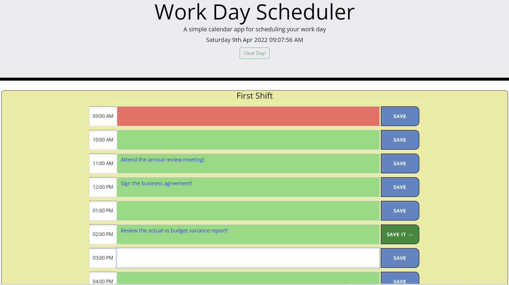

# Work Day Scheduler

Single-day planner that saves text inputs and also color codes by the hour depending on whether the planner events are in the past, present, or future, as indicated by grey, red, and green.

## Table of Content

- [About](#about)
- [User Story](#user-story)
- [Acceptance Criteria](#acceptance-criteria)
- [Visual](#visual)
- [Build](#build)
- [Setup](#setup)
- [Credits](#credits)
- [License](#license)
- [Contributing](#contributing)

## About

A very simple and user friendly Calendar Application that allows users to schedule events for each hour of the three work schedule shift of the day.

## User Story

    AS AN employee with a busy schedule
        • I WANT to add important events to a daily planner
        • SO THAT I can manage my time effectively

## Acceptance Criteria

    • GIVEN I am using a daily planner to create a schedule
    • WHEN I open the planner
    • THEN the current day is displayed at the top of the calendar
    • WHEN I scroll down
    • THEN I am presented with timeblocks for standard business hours
    • WHEN I view the timeblocks for that day
    • THEN each timeblock is color coded to indicate whether it is in the past, present, or future
    • WHEN I click into a timeblock
    • THEN I can enter an event
    • WHEN I click the save button for that timeblock
    • THEN the text for that event is saved in local storage
    • WHEN I refresh the page
    • THEN the saved events persist

## Visual:

## Build

Semantic tags have been used in HTML to create accessible content.
The following tools are used to build the application

    • A CSS framework called Bootstrap was used to build this site.
    • It is possible to use custom fonts through Google Fonts without having to install them on the user's computer
    • Font Awesome supports custom icons
    • jQuery powers the dynamic rendering of the html content based on user input
    • Moment.js is utilized to extract historic data from APIs by manipulating date values

## Setup

    Using the following link, you can clone the most recent version of repo into your machine:
    https://github.com/ghashe/work-day-scheduler.git

    Use the following link to open the app in your browser:
    https://ghashe.github.io/work-day-scheduler/

## Credits

    Abyou Geletu

## License

The application was built by Abyou Geletu. The MIT license applies to this software.

## Contributing

Create a pull request if you want to contribute. To do so, follow these steps:

    • Create a fork of the repository
    • Add a feature branch (git checkout -b NAME-HERE)
    • Your new feature can now be committed (git commit -m 'Add some features')
    • Then push your branch (git push)
    • Submit your Pull Request

Once the code review is complete, your feature will be merged.
